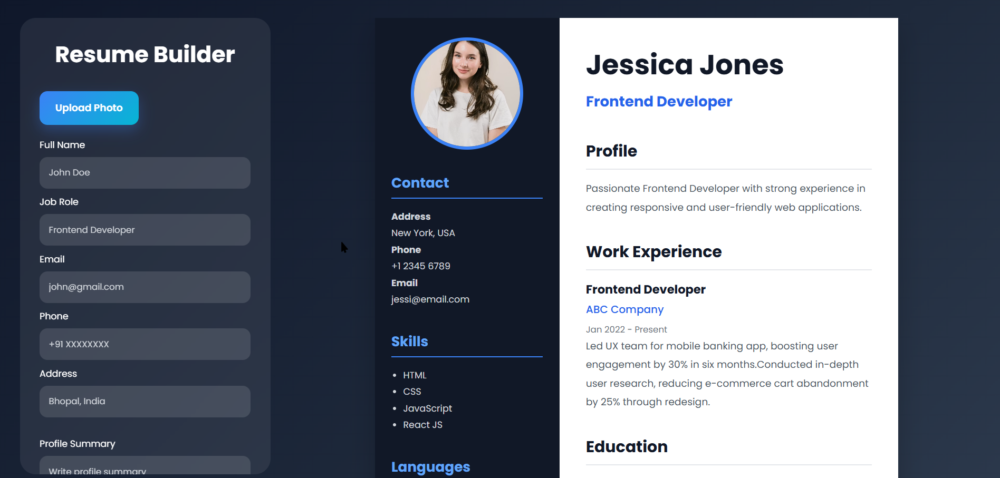

# Resume Builder

A modern and responsive **Resume Builder** built using **HTML, CSS, and JavaScript**. It enables users to create a professional resume by filling in their details, previewing the resume in real time, uploading a profile picture, and downloading the final resume as a PDF.

## 🚀 Features

- Modern A4 resume layout
- Live resume preview
- Upload profile picture
- Dynamic addition and removal of:
  - Skills
  - Languages
  - Hobbies
  - Work Experience
  - Education
- Multiple work experience entries
- Multiple education entries
- Form validation before generating the resume
- Download resume as PDF
- Responsive user interface

---

## 🛠️ Built With

- HTML5
- CSS3
- JavaScript (ES6)

---

## 📂 Project Structure

```text
Resume-Builder/
│── index.html
│── style.css
│── script.js
│── README.md
```

---

## 📸 Screenshots

### Resume Builder UI



```
assets/
└── resume-builder.png
```

### Generated Resume


```
assets/
└── generated-resume.png
```

---

## ⚙️ How It Works

1. Upload a profile picture.
2. Enter your personal information.
3. Add your skills, languages, hobbies, education, and work experience.
4. Click **Generate Resume** to update the preview.
5. Download the resume as a PDF.

---

## 📚 JavaScript Concepts Used

- DOM Manipulation
- Event Listeners
- Event Delegation
- Dynamic Element Creation
- Template Literals
- FileReader API
- Form Validation
- Array Iteration
- PDF Generation using window.print()

---

## 💡 Possible Future Improvements

- Multiple resume templates
- Theme customization
- Dark and Light mode
- Local Storage support
- Export as DOCX
- Print optimization
- Drag-and-drop section reordering
- AI-generated profile summary
- Custom font selection

---

## 🚀 Getting Started

Clone the repository:

```bash
git clone https://github.com/SatyamRaghuwanshii/Resume-Builder.git
```

Navigate to the project folder:

```bash
cd JsEventListner-Project02
```

Open `index.html` in your preferred browser.

---

## 🤝 Contributing

Contributions are welcome!

If you have suggestions or improvements:

1. Fork the repository
2. Create a new branch
3. Commit your changes
4. Open a Pull Request


---

## ⭐ Support

If you found this project useful, consider giving it a **⭐ Star** on GitHub.